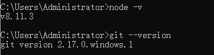

> 只是有了搭建一个属于自己网站的冲动，对服务器、域名基本没什么了解，刚开始的时候其实是处于一种懵逼状态的。那么最开始我是从哪里入手的呢？`Hexo`。在明白自己想要建一个什么样的网站之后，去寻找我想要一个什么要的博客网站，它是怎么做的。这里贴上我同事的个人博客网站[http://www.zhanglongdream.com/](http://www.zhanglongdream.com/)

## 一、本地安装Hexo，及其学习使用

[Hexo中文文档](https://hexo.io/zh-cn/docs/)

  Hexo上手起来还是非常简单的，首先确保自己的电脑中`Node`环境和`git`均已安装。网上的教程很多，这里就不再赘述。命令行查看自身`node`及`git`版本：

    $ node -v
    $ git --version
  
  运行结果为表示`node`、`git`均已成功安装。接下来`npm`运行以下命令安装Hexo

    $ npm install -g hexo-cli
  
  接下来根据文档逐步执行Hexo项目初始化命令

    $ hexo init my-blog // 此处的'my-blog'即为自己的Hexo文件名
    $ cd my-blog
    $ npm install

  打开`my-blog`，可以看到目录列表：

    .
    ├── _config.yml  // 整个项目的配置文件，包括页面的标题、作者、语言等等
    ├── package.json  // 依赖包配置文件
    ├── scaffolds  // Hexo的模块文件夹，在命令行新建文章的时候会根据此文件的模板进行文章内容填充，可以与html中的模板引擎类比理解
    ├── source  // 资源文件夹。文章中需要引用的静态图片之类的文件可以放在这个文件夹下，包括Hexo编译前的markdown文件，也在这个目录下
    |   ├── _drafts
    |   └── _posts
    └── themes  // 主题文件，Hexo初始化的主题并不为next，即本网站所使用的主题。需后续在此目录下修改

  然后我在了解了一些`_config.yml`及Hexo的基本命令之后就直接开始了写作

    $ hexo new post hello-world

  命令行运行之后在`source - _posts`文件夹下就会多出来一个`hello-world.md`，这个文件就是我们的文章文件了。我们对它进行修改，然后运行

    $ hexo g

  这个命令其实是`hexo generate`的缩写，功能是生成静态文件。
  我们可以看到项目中多出来一个`public`文件夹，即为Hexo帮我们编译之后生成的静态页面文件夹。
